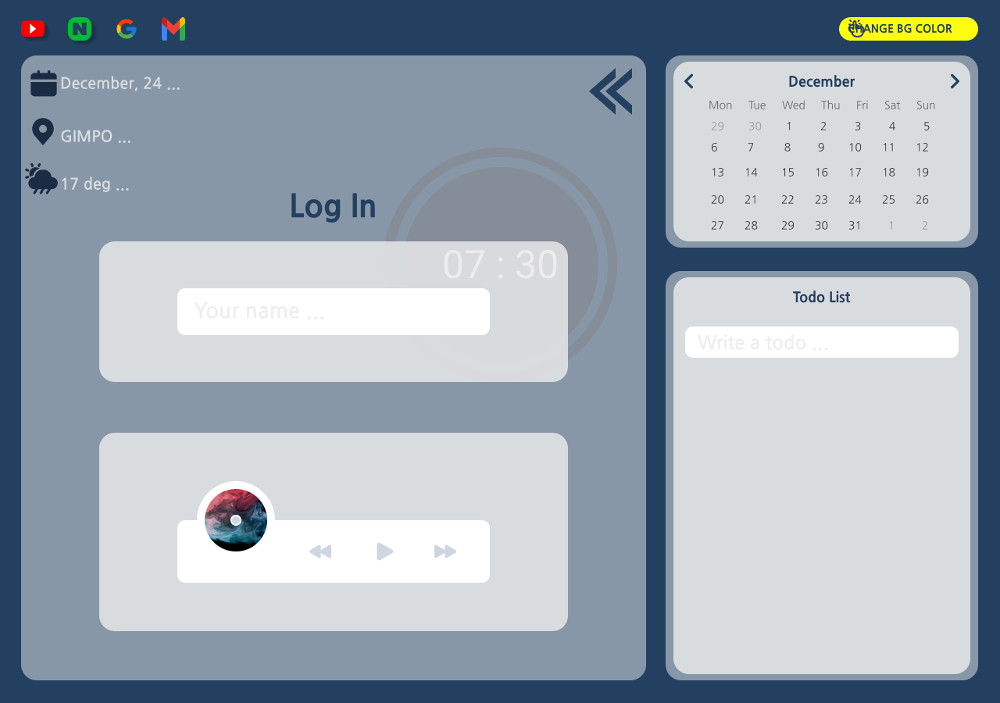
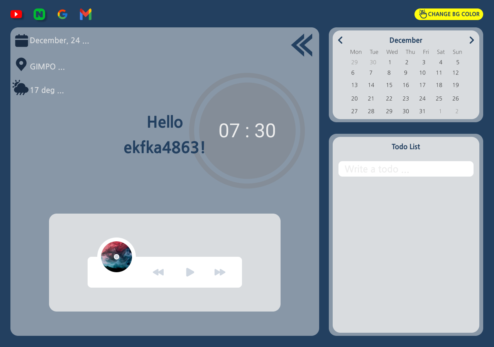
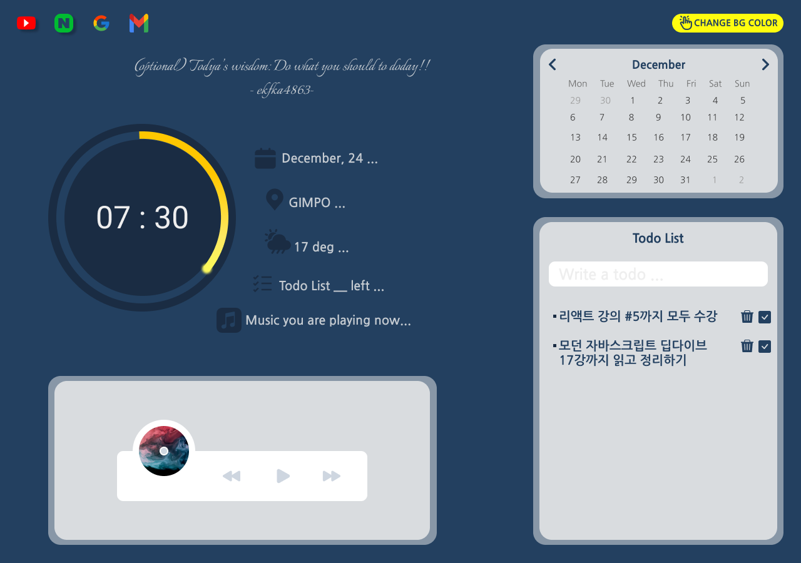
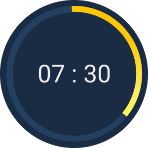

# ✨ 노마드코더 챌린지 19기 개인 졸업작품 👉 My Momentum ✨ 

📍 [DEMO](https://ekfka4863.github.io/myMomentum/) 📍 

 

## 💡 기본 Information
📌 개발 기간 📆 : 
- 2021.12.24.금요일 - 2021.12.27.월요일   

 
 

## 💡 기술 stack

### Front-End
- `HTML`
- `CSS`
- `JavaScript`
- `Git`

 

### 디자인 Tool 🖌️
- `Figma`

 

#### Figma로 구현한 디자인 🎨

 

 

📍 [이미지 자세히 보기](https://github.com/ekfka4863/myMomentum/tree/main/figma) 📍 

 
 

## 💡 챌린지 조건 / 어플리케이션 주요 기능 

1. 실시간 시계 기능 
2. 로컬 스토리지를 사용한 로그인 기능 
3. 로컬 스토리지를 사용한 투두리스트 기능 
4. 랜덤 배경 이미지/컬러 변경 기능 
5. 날씨와 위치 (geolocation) 나타내기 기능
6. 나만의 CSS 실력을 뽐내기💖

 

☝️ 제출은 `깃헙.io` 포멧으로 제출할 것!

 
 

## 💡 구현한 어플리케이션 / 결과물 

 

📍 [DEMO](https://ekfka4863.github.io/myMomentum/) 📍     
📍 [Displayed in NomadCoder's website](https://nomadcoders.co/community/thread/1617) 📍 

 
 

## 💡 챌린지 피드백 / 소감 / 후기
### 배운 점     
  - 조건이 명확하게 주어진 챌린지였기 때문에, 언급된 기능을 어떤 메서드로 어떻게 구현할 것인가에 대해 많은 고민을 해볼 수 있는 기회였다고 생각한다.
    - 챌린지를 참여하면서 들은 노마드코더 강의 복습에 효과적이었다    
      - e.g. geolocation, weather API 불러오기 등
    - `pseudo code`로 어떤 function 부터 구현해서 어디에 넣을지 전반적인 flow를 생각하는 힘을 기르는 좋은 연습시간이었다
  

### 아쉬운 점   
  - 디자인적으로 감각이 없다는 생각에 `figma`로 디자인적으로 내가 만들고자 하는 application의 frame을 만들었는데,     
  생각보다 시간이 많이 걸려서 코딩하는 시간이 상대적으로 모자랐다.    
  - 투두리스트 자체를 만드는 것은 혼자 힘으로도 가능했으나, 익숙하지 않은 개념인 localStorage에 배열의 형태로 todolist를 저장/삭제하는 기능 구현과, 브라우저를 새로고침해도 localStorage에 남아있는 todos를 rendering하게 하는 기능을 구현하는 것은 다소 어려웠다.     
  그래서 강의를 다시 보고 따라하면서 하다보니 시간이 생각보다 많이 필요했고, 막판에는 완벽한 기능 구현을 하지 못하고 제출하게 되어 너무 아쉬웠다.        
  ~~결국에는 해결해냈지만, 원래 챌린지 제출시간보다는 오바해서 코딩을 해야했던 것이 계획과는 다르게 흘러간 부분이라 아쉬웠다🥲~~        
  - 클린 코딩을 하고 싶었지만, 실력 부족으로 인해 다소 지저분하고 중복되는 구간이 있었다.    
  - 원래 디자인을 기획할 때는 하루 24시간을 나눠서 시간에따라 clock에 노란색 border를 주는 것을 계획했었다.        
    하지만, 시간 부족과 실력 부족으로 인해 `switch` 조건문과 `clip-path` 를 사용해서 만들어보는 것이 가능할 것인지 시도해보다가 결국 해당 스타일링을 완성하지는 못했다.         

    

### 만족한 점   
- 한 챌린지에 참여하여 끝까지 완주했다는 성취감이 있었다. 
- 또한 이번 챌린지의 졸업작품으로 만든 myMomentum 어플리케이션이 노마드코더 바닐라 JS 챌린지 19기 우수 졸업생 완성작으로 뽑혀서 언급된 것이 정말로 너무 기뻤다.    

📍 [Displayed in NomadCoder's website](https://nomadcoders.co/community/thread/1617) 📍 

 
 

🎄 읽어 주셔서 감사합니다! 더 성장하는 개발자가 되겠습니다! 🎉
